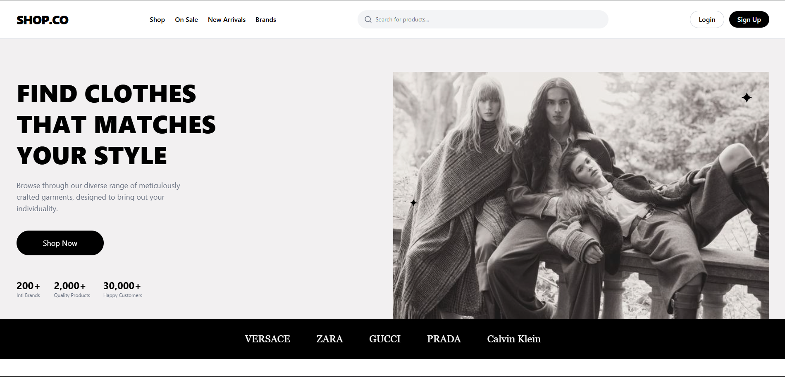

# SHOP.CO - Modern Fullstack E-Commerce

**SHOP.CO** adalah aplikasi web E-Commerce responsif yang dibangun menggunakan arsitektur *Headless* (Frontend dan Backend terpisah). Project ini mengimplementasikan pengalaman belanja lengkap bagi user serta sistem manajemen inventaris (CMS) yang kuat bagi Admin.

#### 📸 Tampilan


---

## 🛠️ Teknologi yang Digunakan

**Frontend:**
* **React.js** (Vite) - UI Library
* **Tailwind CSS** - Styling Framework
* **Axios** - HTTP Client untuk API
* **React Router DOM** - Navigasi Halaman
* **React Hot Toast**: Notifikasi pop-up interaktif.
* **React Icons** - Ikon Antarmuka

**Backend:**
* **Laravel 10** - PHP Framework (REST API)
* **MySQL** - Database Management
* **Laravel Sanctum** - API Authentication (Token Based)
* **Laravel Storage** - Manajemen File & Gambar

**Deployment:**
* **Frontend:** Vercel
* **Backend & Database:** Railway

---

## ✨ Fitur Utama

### 👤 Fitur Pengguna (Customer)
1.  **Homepage Interaktif:**
    * Hero Banner & Brand List.
    * **New Arrivals:** Menampilkan produk terbaru dengan toggle *View All*.
    * **Live Search:** Pencarian produk *real-time* di navbar dengan *dropdown suggestion*.
2.  **Detail Produk Lengkap:**
    * Galeri foto produk.
    * **Custom Variants:** Pilihan warna visual (Hex Code) dan kategori ukuran (Tops/Bottoms/Kids).
    * Validasi stok dan pemilihan varian sebelum masuk keranjang.
3.  **Shopping Cart & Checkout:**
    * Manajemen keranjang (Update Qty/Hapus).
    * Kalkulasi Subtotal otomatis.
    * Simulasi Checkout dan pembuatan Order ID.
4.  **User Dashboard:**
    * **Riwayat Pesanan:** Melihat status pesanan (Paid/Pending) dan detail barang yang dibeli.

### 🛡️ Fitur Admin (Dashboard)
1.  **Dashboard Statistik:**
    * Visualisasi Total Pendapatan, Total Order, Total Produk, dan User Aktif.
2.  **Manajemen Produk (CRUD):**
    * **Create:** Upload gambar, set harga, deskripsi, dan input varian warna (RGB/Hex) serta multi-size.
    * **Read:** Tabel daftar produk dengan fitur pencarian dan pagination.
    * **Update:** Edit detail produk, ganti gambar, dan update varian.
    * **Delete:** Hapus produk dari katalog.
3.  **Manajemen Order:**
    * Melihat daftar pesanan masuk dari customer.

---

## 🚀 Cara Menjalankan Proyek Secara Lokal

Proyek ini terdiri dari dua bagian (backend dan frontend) yang harus dijalankan **secara bersamaan** di dua terminal terpisah.

**Prasyarat:**
* **XAMPP:** Pastikan **MySQL** dan **Apache** sudah berjalan.
* **Composer:** Manajer paket PHP.
* **Node.js & NPM:** Runtime JavaScript.

### 1. Backend (Laravel API)

1.  Buka terminal, masuk ke folder backend:
    ```bash
    cd backend-shop
    ```
2.  Install dependensi PHP:
    ```bash
    composer install
    ```
3.  Salin file konfigurasi environment:
    ```bash
    cp .env.example .env
    ```
4.  Buka file `.env` dan sesuaikan pengaturan database:
    ```env
    DB_CONNECTION=mysql
    DB_HOST=127.0.0.1
    DB_PORT=3306
    DB_DATABASE=shop_co  # Pastikan database ini sudah dibuat
    DB_USERNAME=root
    DB_PASSWORD=
    ```
5.  Generate Application Key & Migrasi Database:
    ```bash
    php artisan key:generate
    php artisan migrate:fresh --seed
    ```
6.  **PENTING:** Buat shortcut untuk gambar produk:
    ```bash
    php artisan storage:link
    ```
7.  Jalankan server backend:
    ```bash
    php artisan serve
    ```
> 🖥️ **Backend berjalan di `http://127.0.0.1:8000`**

### 2. Frontend (React App)

1.  Buka **terminal BARU**. Masuk ke folder frontend:
    ```bash
    cd frontend-shop
    ```
2.  Install dependensi JavaScript:
    ```bash
    npm install
    ```
3.  Buat file `.env` di folder `frontend-shop`, isi konfigurasi:
    ```env
    VITE_API_BASE_URL=[http://127.0.0.1:8000/api](http://127.0.0.1:8000/api)
    ```
4.  Jalankan server frontend:
    ```bash
    npm run dev
    ```
> 🚀 **Frontend berjalan di `http://localhost:5173`**

---

## 🌍 Konfigurasi Deployment (Railway)

Agar fitur upload gambar dan database berjalan lancar di Railway, perhatikan konfigurasi berikut pada service Laravel:

1.  **Root Directory:** `/backend-shop`
2.  **Start Command:**
    ```bash
    php artisan storage:link && php artisan migrate --force && php artisan serve --host=0.0.0.0 --port=$PORT
    ```
3.  **Volumes (Wajib untuk Gambar):**
    * Mount Path: `/app/storage/app/public`

---

## 👤 Penulis

* **Nama:** Rizki Firdaus Purnama
* **Peran:** Fullstack Developer (Student)
* **Institusi:** Binus University